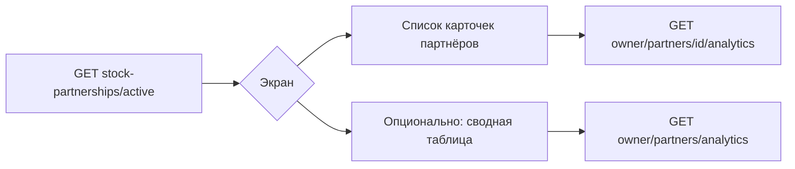

# Аналитика компаний-партнёров (склад) — API для фронтенда

Владелец своей компании может смотреть **складскую аналитику компаний-партнёров** — тех же, что доступны для межкомпанейного склада и кассы после принятия партнёрства.

**Связанные документы:**

- Партнёрство (заявки, каталог, transfer, инкассация): [warehouse_stock_partnership_frontend.md](./warehouse_stock_partnership_frontend.md)
- Общие правила модуля склада (JWT, `?branch=`, ошибки): [apps/warehouse/FRONTEND_API.md](../apps/warehouse/FRONTEND_API.md), раздел 1
- Собственная аналитика владельца (`owner/analytics/`): тот же файл, раздел 8

**Базовый URL:** `https://app.nurcrm.kg/api/warehouse/`

---

## Кто такие «партнёры»

Партнёр — компания из ответа:

`GET /api/warehouse/stock-partnerships/active/`

```json
{
  "partners": [
    { "id": "uuid", "name": "Название компании" }
  ]
}
```

Аналитика доступна **только** для `partners[].id`. Любой другой `company_id` → **403** «Нет активного партнёрства с этой компанией».

Это **не** агенты склада (`owner/agents/...`) и **не** контрагенты.

---

## Доступ

| Роль | Доступ |
|------|--------|
| Владелец / admin (`_is_owner_like`) | Да |
| Обычный сотрудник | **403** «Только владелец/админ.» |
| Агент склада | **403** |

Список партнёров (`stock-partnerships/active/`) могут видеть и сотрудники компании; **аналитика партнёров** — только владелец.

---

## Рекомендуемый сценарий UI



1. Загрузить партнёров: `GET .../stock-partnerships/active/`.
2. Период (день / неделя / месяц / свой диапазон) — общие query-параметры (см. ниже).
3. **Сводный экран** (все партнёры в таблице): `GET .../owner/partners/analytics/?period=...`
4. **Детальный экран** одного партнёра: `GET .../owner/partners/{partners[].id}/analytics/?period=...`
5. Опционально фильтр по филиалу **партнёра**: `partner_branch=<uuid>` (только на детальном эндпоинте).

Параметр `?branch=` из общих правил склада относится к **вашей** компании в контексте запроса и **не** подменяет филиал партнёра. Для партнёра используйте только `partner_branch`.

---

## Параметры периода (оба эндпоинта аналитики)

| Параметр | Описание |
|----------|----------|
| `period=day` | Один день: `date` или `date_from` / `date_to` (по умолчанию сегодня) |
| `period=week` | Неделя до `date_to` (по умолчанию сегодня), `date_from` = −6 дней |
| `period=month` | ~30 дней до `date_to` (по умолчанию) |
| `period=custom` | Явно `date_from` + `date_to` |
| `date` | ISO `YYYY-MM-DD` |
| `date_from`, `date_to` | ISO `YYYY-MM-DD` |

Примеры:

```
GET /api/warehouse/owner/partners/analytics/?period=month
GET /api/warehouse/owner/partners/analytics/?period=custom&date_from=2026-01-01&date_to=2026-01-31
GET /api/warehouse/owner/partners/{id}/analytics/?period=week&date_to=2026-03-01
```

---

## 1. Сводка по всем партнёрам

`GET /api/warehouse/owner/partners/analytics/`

Возвращает метрики за период **по каждой** компании из `stock-partnerships/active/`.  
По умолчанию данные партнёра агрегируются **по всем его филиалам** (не по вашему `?branch=`).

### Ответ

```json
{
  "period": "month",
  "date_from": "2026-02-01",
  "date_to": "2026-02-29",
  "partners_count": 2,
  "partners": [
    {
      "partner_company_id": "uuid",
      "partner_company_name": "ООО Партнёр",
      "summary": {
        "requests_approved": 10,
        "items_approved": "120.000",
        "sales_count": 45,
        "sales_amount": "15000.00",
        "on_hand_qty": "80.000",
        "on_hand_amount": "6400.00",
        "money_docs_count": 18,
        "money_receipt_amount": "5200.00",
        "money_expense_amount": "3100.00",
        "money_net_amount": "2100.00"
      }
    }
  ]
}
```

### Поля `summary` (на партнёра)

Считаются по **данным компании-партнёра** (её склады, агенты, касса):

| Поле | Тип | Смысл |
|------|-----|--------|
| `requests_approved` | number | Одобренные заявки агентов за период |
| `items_approved` | string (decimal) | Выдано товаров по заявкам, шт/кг |
| `sales_count` | number | Проведённые продажи агентов |
| `sales_amount` | string | Сумма продаж |
| `on_hand_qty` | string | Остатки у агентов (текущие, не за период) |
| `on_hand_amount` | string | Оценка остатков по цене товара |
| `money_docs_count` | number | Денежные документы (приход+расход) за период |
| `money_receipt_amount` | string | Приход в кассу |
| `money_expense_amount` | string | Расход из кассы |
| `money_net_amount` | string | Чистый денежный поток за период |

Денежные суммы — строки с двумя знаками после запятой (`"15000.00"`).

---

## 2. Детальная аналитика одного партнёра

`GET /api/warehouse/owner/partners/{partner_company_id}/analytics/`

`partner_company_id` = `partners[].id` из `stock-partnerships/active/`.

### Дополнительные query-параметры

| Параметр | Описание |
|----------|----------|
| `partner_branch` | UUID филиала **партнёра** — только его данные |
| *(нет параметра)* | Вся компания-партнёр, **все филиалы** |
| `group_by=day\|week\|month` | Группировка точек на графиках (по умолчанию `day`) |

Пример с филиалом партнёра:

```
GET /api/warehouse/owner/partners/550e8400-e29b-41d4-a716-446655440000/analytics/?period=month&partner_branch=660e8400-e29b-41d4-a716-446655440001
```

### Ответ (структура)

Тот же формат, что `GET /api/warehouse/owner/analytics/`, плюс заголовок партнёра и флаги филиала:

```json
{
  "partner_company": {
    "id": "uuid",
    "name": "ООО Партнёр"
  },
  "period": "month",
  "date_from": "2026-02-01",
  "date_to": "2026-02-29",
  "all_branches": true,
  "branch_id": null,
  "summary": { "...": "..." },
  "charts": {
    "sales_by_date": [
      {
        "date": "2026-02-01",
        "sales_count": 5,
        "sales_amount": "1200.00"
      }
    ],
    "money_by_date": [
      {
        "date": "2026-02-01",
        "docs_count": 3,
        "money_receipt_amount": "800.00",
        "money_expense_amount": "200.00",
        "money_net_amount": "600.00"
      }
    ]
  },
  "top_agents": {
    "by_sales": [
      {
        "agent_id": "uuid",
        "agent_name": "Иван Иванов",
        "sales_count": 10,
        "sales_amount": "3500.00"
      }
    ],
    "by_received": [
      {
        "agent_id": "uuid",
        "agent_name": "Иван Иванов",
        "items_approved": "25.000"
      }
    ]
  },
  "details": {
    "warehouses": [
      {
        "warehouse_id": "uuid",
        "warehouse_name": "Основной",
        "carts_approved": 3,
        "items_approved": "30.000",
        "sales_count": 12,
        "sales_amount": "3400.00",
        "on_hand_qty": "15.000",
        "on_hand_amount": "1200.00"
      }
    ],
    "sales_by_product": [
      {
        "product_id": "uuid",
        "product_name": "Товар А",
        "qty": "10.000",
        "amount": "1500.00"
      }
    ],
    "sales_by_group": [
      {
        "group_id": "uuid",
        "group_name": "Группа 1",
        "docs_count": 12,
        "qty": "10.000",
        "amount": "1500.00"
      }
    ],
    "top_sales_group": {
      "group_id": "uuid",
      "group_name": "Группа 1",
      "docs_count": 12,
      "qty": "10.000",
      "amount": "1500.00"
    },
    "cash_by_register": [
      {
        "kind": "cash_register",
        "account_id": "uuid",
        "account_name": "Касса 1",
        "docs_count": 10,
        "money_receipt_amount": "3400.00",
        "money_expense_amount": "1200.00",
        "money_net_amount": "2200.00"
      }
    ],
    "money_receipts_by_category": [
      {
        "category_id": "uuid",
        "category_title": "Продажи",
        "docs_count": 5,
        "amount": "1500.00"
      }
    ],
    "money_expenses_by_category": [
      {
        "category_id": null,
        "category_title": "Без категории",
        "docs_count": 2,
        "amount": "300.00"
      }
    ]
  }
}
```

При `partner_branch=<uuid>`:

- `all_branches`: `false`
- `branch_id`: `"uuid"` выбранного филиала партнёра

### Отличие от своей `owner/analytics/`

| | Своя компания | Партнёр |
|--|---------------|---------|
| Эндпоинт | `owner/analytics/` | `owner/partners/{id}/analytics/` |
| Филиал | `?branch=` (ваш) | `partner_branch` (их) |
| Без филиала в query | Только записи **без** филиала (`branch IS NULL`) | **Все** филиалы партнёра |
| Долги контрагентов агентов | Нет в owner | Нет (как у owner) |

---

## Ошибки

| HTTP | Условие | Текст / смысл |
|------|---------|----------------|
| **401** | Нет JWT | Стандартно |
| **403** | Не владелец | `Только владелец/админ.` |
| **403** | `partner_company_id` = своя компания | `Укажите компанию-партнёра, не свою.` |
| **403** | Нет партнёрства | `Нет активного партнёрства с этой компанией.` |
| **403** | Неверный `partner_branch` | `Филиал партнёра не найден.` |
| **403** | Нет компании у пользователя | `Компания не найдена.` |

---

## Кэш

Ответы кэшируются на бэкенде (типичный TTL аналитики). При смене периода или партнёра передавайте новые query-параметры; после проведения документов возможна задержка до истечения кэша.

---

## Чеклист интеграции

- [ ] Экран доступен только владельцу (проверка роли на фронте + обработка 403).
- [ ] Список партнёров: `stock-partnerships/active/`.
- [ ] Пустой `partners: []` — показать заглушку «Нет партнёров», без вызова analytics.
- [ ] Сводка: `owner/partners/analytics/` + выбор периода.
- [ ] Деталь: клик по партнёру → `owner/partners/{id}/analytics/`.
- [ ] Суммы парсить как decimal/string, не как float без округления.
- [ ] Не путать `branch` (ваша компания) и `partner_branch` (партнёр).

---

## TypeScript (ориентир)

```ts
type PartnerRef = { id: string; name: string };

type PartnerAnalyticsSummary = {
  requests_approved: number;
  items_approved: string;
  sales_count: number;
  sales_amount: string;
  on_hand_qty: string;
  on_hand_amount: string;
  money_docs_count: number;
  money_receipt_amount: string;
  money_expense_amount: string;
  money_net_amount: string;
};

type PartnersAnalyticsListResponse = {
  period: string;
  date_from: string;
  date_to: string;
  partners_count: number;
  partners: Array<{
    partner_company_id: string;
    partner_company_name: string;
    summary: PartnerAnalyticsSummary;
  }>;
};

// Детальный ответ = PartnersAnalyticsListResponse['partners'][0]['summary']
// + partner_company, charts, top_agents, details (см. owner/analytics в FRONTEND_API.md)
```
